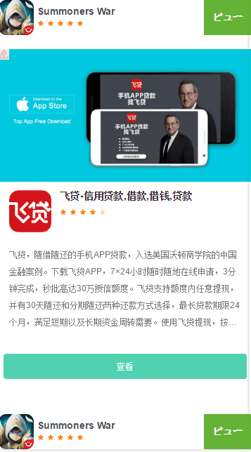

### Cloudmobi JSTag 广告接入方式说明

* [方式一：直接引入js文件](#直接引入js文件)
* [方式二：实用调用请求接口](#实用调用请求接口)

#### 直接引入js文件

在WAP页面引入`http://image2.cloudmobi.net/jstag/v1/{slotid}/ad.min.js`，其中需要替换掉链接中的宏`{slotid}`例如：

```
<head>
    <script src="http://image2.cloudmobi.net/jstag/v1/8888/ad.min.js"></script>
</head>   
```
| 参数名 | 参数描述 |
| :--: | :--: |
| slotId | 广告位ID，在cloudmobi注册后由账户经理进行分配 |

#### 实用调用请求接口


__注：需要先引入`ad.js`才能调用`ct.showAd();`__


调用示例：

```
<div id="iframe1">
    <script>
        ct.showAd('iframe1', 11);
    </script>
</div>
```

广告展示示例：
----




getAds
----

ct.getAds()获取多条广告数据并利用该数据进行操作

调用`ct.getAds(slotId, callback, num)`方法，获取广告元数据并使用callback函数对数据进行处理

| 参数名 | 参数描述 |
| :--: | :--: |
| slotId | 广告位ID，在cloudmobi注册后由账户经理进行分配 |
| callback | 回调函数，callback的参数名为data，data的类型为Array |
| num | 广告数量 |

callback参数data组成示例：
----

```
[
	{ 
		"icon": "http://cdn.cloudmobi.net/icon/1.png",
        "title": "plan",
        "image": "http://i1.tobei.cn/2014/1222/20141222092542930.jpg",
        "desc": "御剑情缘-登录送绝版飞剑 全民DIY家园开启",
        "button": "install",
        "rank": 4.2,
	    "clkUrl": "https://github.com"
	},
	{ 
		"icon": "http://cdn.cloudmobi.net/icon/1.png",
        "title": "仙剑奇侠传3D回合-互动直播欢乐交友",
        "image": "http://i1.tobei.cn/2014/1222/20141222092542930.jpg",
        "desc": "《仙剑奇侠传3D回合》一款3DMMORPG回合制手游，由大宇全系列正版授权、盖娅互娱自主研发。",
        "button": "install",
        "rank": 4.2,
	    "clkUrl": "https://github.com"
	}
]
```

